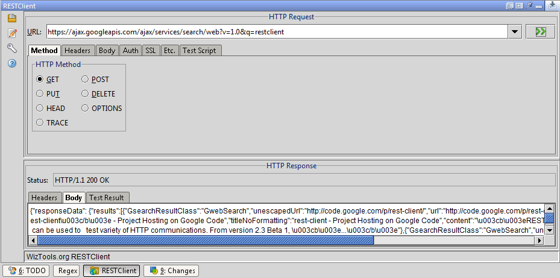

# restclient-idea-plugin

Adds the WizTools RestClient to IntelliJ IDEA. See the JetBrains Plugin Repository for more information:

https://plugins.jetbrains.com/plugin/5951-restclient

Archived code repository is available [here](https://code.google.com/archive/p/restclient-idea-plugin/).
